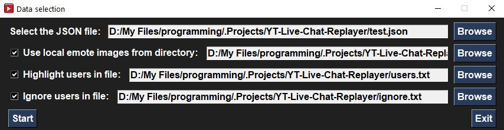
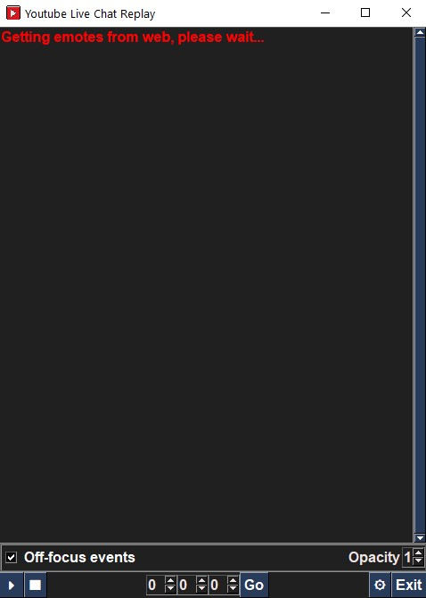

# YT Live Chat Replayer
A GUI app that can replay the live chat from a YouTube live stream, using the JSON file containing the chat data (obtained with [yt-dlp](https://github.com/yt-dlp/yt-dlp) for example).

The app supports playback of the chat messages, including emotes. Membership notifications, membership messages, as well as superchat messages are highlighted. Additionally, there is the option to highlight messages from specific users, by providing a text file with each username in a separate line.

    
! WARNING !

    The JSON file that contains the chat data needs to be in the condensed format for the app to work (1 chat message dictionary per line)! This is unfortunatelly due to the structure of the JSON file provided by YouTube.

## Table of Contents
- [How to run](#how-to-run)
- [How to use](#how-to-use)
- [Notable features](#notable-features)
    - [Transparency](#transparency)
    - [Off-focus start/pause/resume](#off-focus-startpauseresume)
- [Settings](#settings)

## How to run
(Note: If you are using windows, you can use the executable from the [Releases Page](https://github.com/AntonisTorb/YT-Live-Chat-Replayer/releases). You might have some issues with your Windows Defender/Antivirus though, so I do not recommend it.)

Instructions for Windows:
- Make sure you have Python installed on your system.
- Open a Terminal/Powershell/Command Line window in the directory of the `main.py` file. On windows, you can navigate to this directory by executiong the command `cd 'the directory path here'`
- Execute the command `pip install -r requirements.txt` to install all the required packages. This might take some time.
- Execute the command `python main.py` to start the app.

## How to use

The first window you will see is where you can select the chat JSON file, and optionally the directory containing the emotes, the file containing the usernames to highlight (`.txt`, one username per line), as well as the file containing the usernames to ignore(`.txt`, one username per line). If you want to use any of those three optional features, please make sure to also check the box next to each one.

After selecting all the data you need and want, press the `Start` button. Depending on the size of the JSON file and the amount of emotes, it might take some time for the app to become responsive depending on the size of the chat file and the amount of emotes that need to be downloaded, so please wait for a bit. This is the window that appears after pressing `Start`:

Once the app window becomes responsive again, you will be able to see all the chat messages with a negative timestamp. You can then press the `play` button at the bottom left to begin playback. The same button can be used to `pause`.

Next to the play button is the `Stop` button, used to reset the playback to zero.

The three input fields to the right of the `Stop` button represent the `hours`, `minutes` and `seconds` of the current playback timestamp. If you want you can edit them and press the `Go` button to jump to a specific timestamp (Note: if the timestamp selected this way is longer than the last chat timestamp, then playback will continue with no new messages appearing, so please keep in mind to stay within the limits).

At the far right you will find the `Exit` button to quit the app, and to it's left the `Settings` button. Pressing the `Settings` button opens a small area between the chat window and the controls at the bottom, where you can update some settings on the go.

 In the settings area you will find the checkbox `Off-focus events`, allowing the chat window to receive [off-focus events](#off-focus-startpauseresume), as well as an `Opacity` spin element, allowing you to modify the opacity of the window while it's running. Please refer to the [Settings](#settings) section for all available settings.

## Notable features

### - Transparency

The app has some transparency options (please check the [Settings](#settings) section), so you can overlay it on top of the media player of your choice. This way, if you have only a single monitor you can take full advantage of the screen space for the playback. The app will also always stay on top of the media player screen, unless it's on fullscreen.

### - Off-focus start/pause/resume

The app can also accept start/pause/resume keyboard events (`space` button) even when it is not in focus. This way, you don't have to manually sync the timing everytime you need to pause. Just press `space` with the media player window in focus and the chat playback will pause as well. Just be carefull not to press `space` in another app. Youcan disable this functionality as explained in the [How to use](#how-to-use) section.

## Settings

You can find several settings in the `settings.json` file. Here are the settings, default values, as well as an explanation of what each setting does:

- `"FONT_NAME": "Arial"`: The font family used for the display of text.
- `"FONT_SIZE": 12`: The font size used for the display of text.
- `"STYLE": "bold"`: The font style used for the display of text. For no style, use an empty string instead of bold, like this: `"STYLE": ""`
- `"TEXT_COLOR"`: The color used for the display of text.
- `"NOTIFICATION_COLOR": "red"`: The color used for the display of notifications.
- `"TIMESTAMP_COLOR": "red"`: The color used for the display of timestamps.
- `"USERNAME_COLOR": "orange"`: The color used for the display of usernames.
- `"BG_COLOR": "#202020"`: The default background color used.
- `"MEMBER_BG_COLOR": "blue"`: The background color used for the display of membership notifications and membership messages.
- `"SUPERCHAT_BG_COLOR": "green"`: The background color used for the display of superchat messages.
- `"HIGHLIGHT_USER_BG_COLOR": "purple"`: The background color used for the display of highlighted user messages.
- `"EMOTE_SIZE": [24,24]`: The size of the emotes displayed.
- `"CHAT_LENGTH": 30`: The maximum amount of messages retained in the chat window. Reducing this increases performance.
- `"DISABLE_TITLEBAR": false`: Whether or not to disable the titlebar of the chat window, to avoid having the solid white titlebar. If set to true (default), then the chat window cannot be resized, in which case you can use:
- `"WINDOW_SIZE" : (480, 640)`: Used to set the size of the window in the format `(width, height)` if the titlebar is disabled.
- `"TRANSPARENT" : false`: Whether to make the chat window fully transparent. This option makes it difficult to move the chat around, a different option is:
- `"ALPHA": 0.7`: The opacity of the chat window, with a value between 0 (fully transparent) and 1 (fully opaque). The disadvantage with this option is that the text also becomes transparent along with the window, so the value should not be too low. If you select `"TRANSPARENT" : true`, please set this value to 1.
- `"OFF_FOCUS_EVENTS": true`: Whether the app should receive the `space` keyboard event in order to play/pause/resume the chat playback when the chat window is not in focus.
- `"CONDENSED": true`: When set to true, minimizes the empty space allowed in the chat window (removes empty lines after username and bewteen each chat message).
- `"SHOW_TIMESTAMP": false`: Whether or not to show the timestamp of the chat message next to the username.

## Thank you and enjoy!
